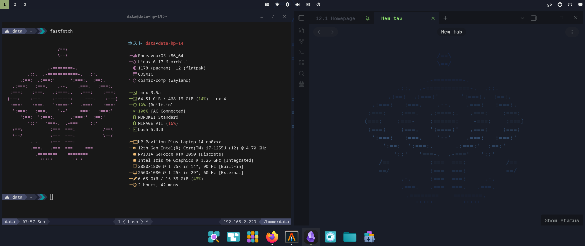
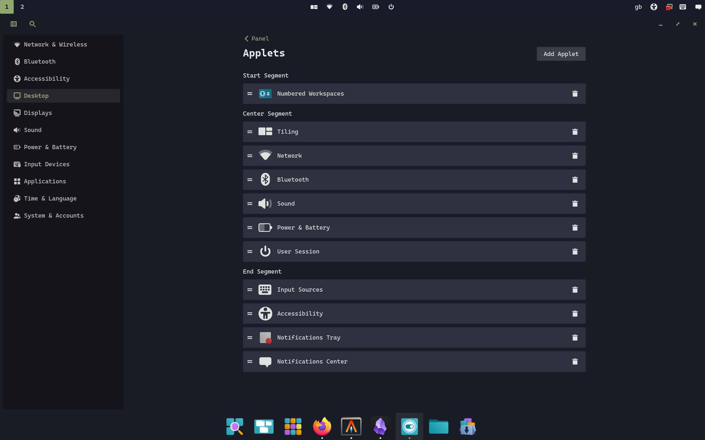

# About Flexcyon

This is a [Cosmic DE](https://system76.com/cosmic) port of the Obsidian.md theme
Flexcyon. It combines the colour schemes of Halcyon and Flexoki.

> I really liked the vibrant colours of the
> [Halcyon colour scheme](https://halcyon-theme.netlify.app/), and the inky
> aesthetic of the [Flexoki colour scheme](https://stephango.com/flexoki). Hence,
> I decided to combine the two which started this theme.

You can find out more about [the Obsidian.md theme here](https://github.com/bladeacer/flexcyon).
